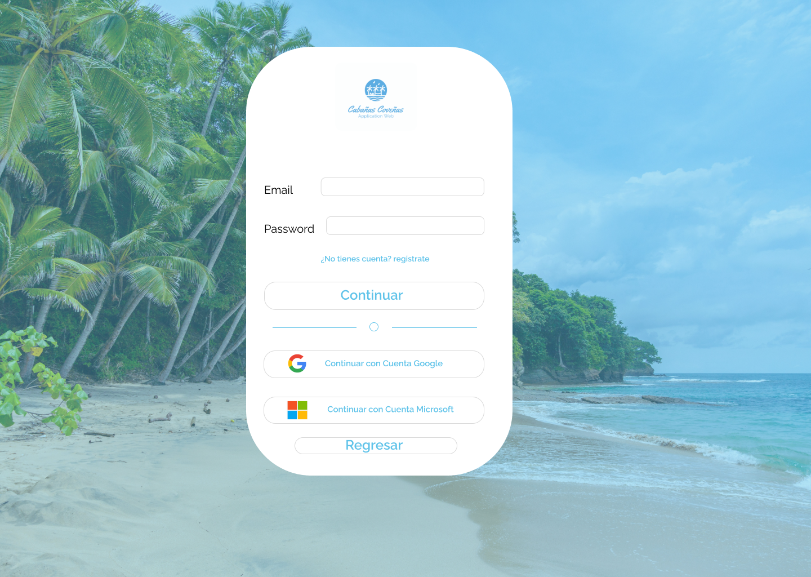
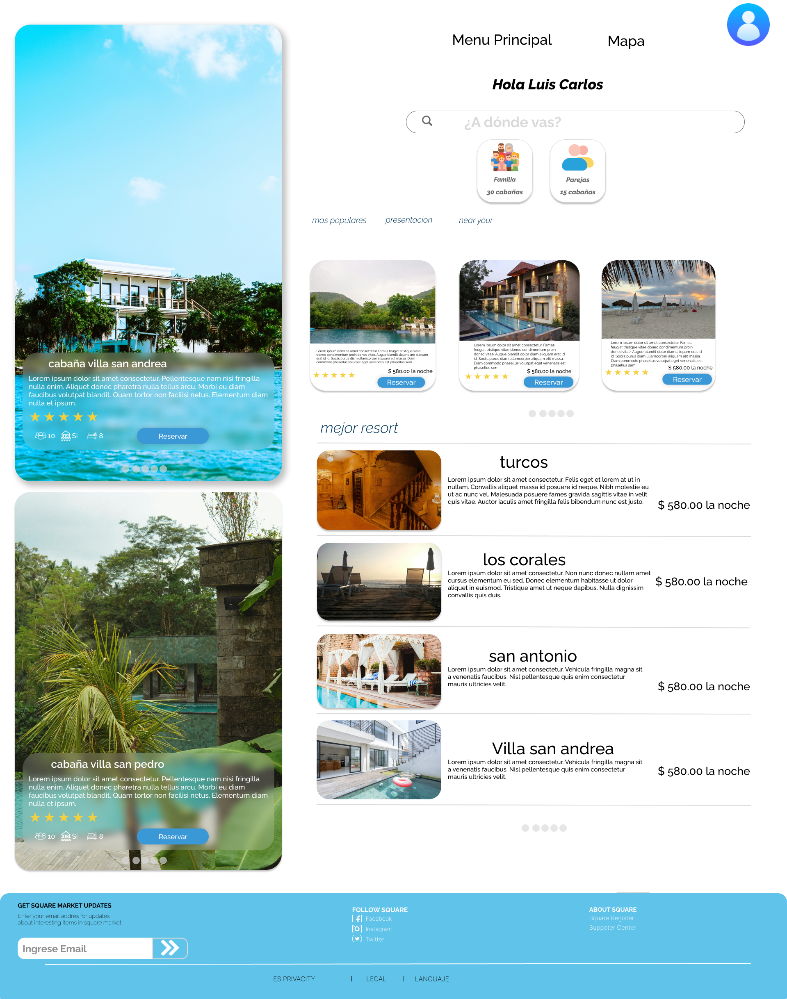

# Desarrollo de una web app (P.W.A) para optimizar el proceso de reservación de cabañas en el municipio de Coveñas

Autor : Luis Carlos Siva Aguas

Programa : Ingenieria de sistemas

## Introducción
En el siglo 21 la tecnologia ha sido fundamental para el desarrollo economico del turismo en cualquier ciudad del mundo ahora en el municipio de coveñas departamento de sucre las personas viven del turismo como pilar fundamental para sostenimiento del municipio, ahora el municipio reciebe turistas de todas de colombia y del mundo donde viene a disfrutar actividades de sol, playa y ecoturismo pero con el creciente auge de turismo las personas buscan de formas rapida los hoteles pero con ocupacion alta en las temporadas donde hay mas turistas los hoteles se quedan toma la opcion de las cabañas pero hay casos de las personas de otras partes de colombia llegan pero ocupacion esta maximo ocupacion ni teniendo las plataformas digitales la es maxima tambien personas que se ponen dar vueltas en circulo buscando un cabaña o colocan excusas entre otras situaciones que se presentan para darle solucion se propuso crear una app web tipo (P.W.A) aplicacion web progresiva que permite tener las facilidades para turismo como son tiempo real la informacion de la cabañas, tener imagenes 360 grados para mirar mas a fondo la cabaña tener mas informacion de cantidad de personas si son familias o parejas ademas la app web (P.W.A) determina la ocupacion de las playas en la municipio con esta herramienta permite facilitar mas las estadia de los turistas asi pueden tener una mayor facilidades para los turistas tambien mirar lugares donde poder conocer.

## Objetivos del Sistema

### objetivos generales
Desarrollar una aplicación web para la gestión y promoción de cabañas en el sector turístico de Coveñas. 
### objetivos especificos
1. Desarrollar una web app interactiva con un sistema de búsqueda y actualización en tiempo real que permitirá a los viajeros consultar la disponibilidad de cabañas en Coveñas, facilitando una experiencia de reserva eficiente y conveniente.
2. Implementar un sistema de autenticación seguro y método de pago con código QR que garantice la privacidad y seguridad del usuario al acceder a la plataforma y realizar transacciones de reserva de la cabaña.

3. Integrar un chat tipo red social que facilita la comunicación en tiempo real entre los viajeros y los propietarios de las cabañas, brindando un espacio para resolver consultas, negociar términos adicionales y obtener más información sobre alojamientos de las cabañas en vivo. Además, se incluyen imágenes de 360 grados de las cabañas para brindar a los turistas una experiencia de visualización realista y detallada.

4. Evaluar pruebas y evaluaciones de la web app en conjunto con turistas y propietarios de cabañas en Coveñas, con el fin de identificar posibles mejoras y asegurar su eficiencia y efectividad en la gestión de la disponibilidad de cabañas y la reserva en línea.

## Alcance del Proyecto

La app web (P.W.A) consiste en desarrollar una herramienta que permita los visitantes tener una experiencia mas confortante
es decir tener facilidades para las cabañas tener otras alternativas aparte de los hoteles ahora el alcance que tien la app web es 
que las personas puedan buscar la disponibilidad de las cabañas en tiempo real mirar de una mas intuitiva con 360 grados la cabaña
con esto permitara a los usuario ubicarse a un mas en el municipio para encontrar un lugar cuando se pueda elegir lugares favoritos calificacion de la cabaña ademas pueda observar en 360 grados tambien tener una comunicacio  directa con los dueños de las propiedades usar la app web directamente si necesida de gastar recursos tener usarla de manera mas facil, tambien medidas de seguridad para todos los usuarios como son autentifiacion para los usuarios por medio de token asi mismo garatizar que los usuarios tener una mayor efectvidad al uso de app web para el el uso de la tecnologia para app web para la parte de fronted se va usar react typescript con styled components y para la parte backend se ba usar php leaf para reducir costo de mantebilidad del sistema para la gestion de las base de datos es mysql, ahora el alcance del protecto se limito a la web ya que las personas cuando van a buscar sacan el celular buscan en los navegadores no van a playstore a descargar una aplicacion de celular se estima que el desarrollo tomara entre 1 año y 2 años para fase de desarrollo por que se debe tomar las fases de crear de las interfaces usuario los pruebas que al sistema se deben hacer para la calidad del sistema sea eficiente.

El éxito del proyecto estará vinculado a varios factores importantes, como el diseño de interfaces fáciles de usar, el manejo seguro de pagos y el cumplimiento de los plazos fijados. Al concluir, la plataforma intentará brindar una solución efectiva y segura para ayudar con las reservas de hospedaje y ofrecer una experiencia placentera tanto para anfitriones como para viajeros..

## Análisis de Requisitos

### Requisitos Funcionales
---
1. Permitir que los usuarios realizen busquedas de filtrado en las cabañas es decir numero de personas si son familias o parejas el valor
de precios tambien la ubicacion de la cabaña en el municipio de coveñas.

2. Ofrecer herramientas que los turistas pueda ocupar la cabaña mas rapido la disponibilidad inmediata en tiempo real 

3. Presentar imagenes en 360 grados de las cabañas para una mayor perspetiva de la cabaña

4. Experiencia de usuario offline para acceder algunas partes de la aplicación incluso cuando no tengas Internet. Esto hace que el uso de la aplicación sea mejor y
 es algo que se puede solicitar al planificar la app web (P.W.A).

5. Asi mismo tener informacion en tiempo sobre la ocupacion de las playas 

### Requisitos No Funcionales
---
1. Disponibilidad de app web(P.W.A) debe ser inmedianta con la informacion

2. La plataforma debe responder rapidamente las peticiones de los usuarios asi sea en las temporadas altas alojamientos

3. la app web(P.W.A) debe ser capaz manejar gran volumen de solucitudes sin comprometer el rendimiento 

4. La interfaz de usuario tiene que ser intuitiva y sencilla de manejar para usuarios de todos los niveles.

5. el codigo debe ser bien estructurado garatizando un buen funcionamiento

## Prototipo del Sistema

### Definición del Prototipo

Tipo de prototipo: **Evolutivo**

el proposito de este sistema darle herramientas para que los turistas las personas puedan tener experiencia mas agradable puedan tener informacion en tiempo real de las cabañas y asi mismo la ocupacion de las playas

## Detalles del Diseño

### Pagina 1 - Presentacion pagina
.png)
### Pagina 2 - pagina de ecoturimo

### Pagina 3  - login

### Pagina 4 - Ocupacion de las playas

### pagina 5 - Acceso tu cabaña

### pagina 6 - cabañas

### pagina 7 - cabaña registrate

### pagina 8 - Acceso tu cabaña

## Herramientas y Tecnologías Utilizadas

las herramientas que se van usar son :

### metodologia agil desarrollo 
+ metodologia xp 

### Fronted
+ React Typescript
+ Styled components
+ Redux
+ Formik
+ jest testing 

### Backend
+ Leaf PHP
+ phpunit

### base de datos
+ mysql worbech

+ la tecnologia que se implemetara del lado servidor se aplicara el concepto de Apis Rest

+ Para el diseño dela interfaz se usa figma

## Implementación

para poder implementar el app web se crea primero un diagrama entidad relacion que permitira analziar como se debe funcionar la base de datos luego se pasa a la construccion de la api usando php para conectar a la base de datos  con esto se hace los endpoints los verbos de la api con sus peticiones despues que se halla terminado la api se realiza una ser pruebas de software para probar la capacidad de respuesta de la apu cuando hay muchas saturacion de peticiones si la api pasa la gestion de pruebas de software se realiza al fronted que es usando react typescript, redux, styled components , formik y jest testing ahora el de esta herramienta se realiza prueba de software para que el fronted pueda cumplir con las expectativas.

## Conclusiones y Recomendaciones
 la concluciones sobre el desarrollo de software hay es que debe seguir unos parametros de eficiencia en el sistema para que cumpla las funcionalidades al momento que se realiza pruebas al app web debe cumplir estandares de calidad para cumpla con los requrimientos de analis de sistemas asi mismo garantizar con los usuarios puedan usar el sistema en cualquier momento

📓***Un modelo prototipo*** o modelo de desarrollo evolutivo es utilizado principalmente en el desarrollo de software para ofrecer al usuario una visión previa de cómo será el programa o sistema. Se le dice de desarrollo evolutivo al modelo de prototipo porque evoluciona hasta convertirse en el producto final.
